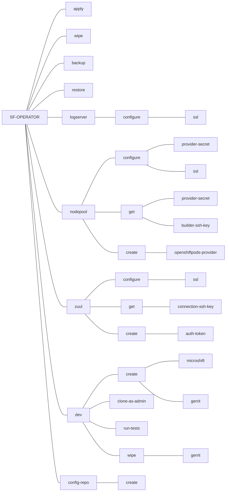

# CLI overhaul

## Context and Problem Statement

`sfconfig`, the project's CLI, has grown in a lot of directions as the operator was being developed.
It has become a bit confusing as it is named "sfconfig" but covers CI, testing, deployments and operator configuration.

It is not providing 1:1 equivalencies with SF 3.8.x's sfconfig, and requires a `sfconfig.yaml`
file to run, which has nothing to do with SF 3.8.x's sfconfig.yaml; adding to the confusion. It is important to keep in
mind, however, that some existing features of `sfconfig` cannot be ported to sf-operator: for example, the upgrade
process will be handled by OLM.

We should stabilize, clarify and rationalize the CLI tooling.

## Considered Action

1. Remove the `sfconfig` CLI in favor of the unified `sf-operator` binary. This marks a clear departure from the legacy CLI and should remove confusion.
2. Clarify subcommands and make them easier to remember by following the pattern `Subject` > `Action` > `Target` [ > `Flags` ], with a
limited and clear set of possible actions:
  * **create** for a one-time creation of a resource (example: creating a namespace)
  * **configure** when a resource can be created then updated later (example: creating the initial SSL configuration of a service then updating it when a certificate expires)
  * **get** to fetch a resource (example: get zuul's public key for connections)
  * **wipe** destroys the resource
3. Print notifications, status reports, ... to stderr and usable output (typically that could be piped to another tool) to stdout. Use exit codes.
4. Rename the current `sfconfig.yaml` to `softwarefactory.config`. This explicitly differentiates this file from the legacy `sfconfig.yaml` and from any custom resource manifest used to deploy a Software Factory.
5. The CLI will be available as the entrypoint of the sf-operator container we publish with each tag.


## softwarefactory.config

Note that this is a proposed default name, and the CLI should be able to pick up the SFCLI_CONFIG environment variable
to get its configuration. We propose the following high level hierarchy, inspired by `kube.config`:

```yaml
contexts:
  - name: dev
    config-repository: /path/to/local/config-repo
    kube-context: microshift.dev
    components: {}
    fqdn: sfop.me
    dev:
      ansible_microshift_role_path: /path/to/ansible-microshift-role/repo
      microshift:
        host: my-microshift.dev
        user: cloud-user
        inventory-file: /path/to/inventory
      tests:
        extra-vars: {}
  - name: staging
      config-repository: ~/dev/sfio/config
      kube-context: microshift.staging
      components:
        nodepool:
          clouds_file: /path/to/clouds.yaml
          kube_file: /path/to/kube.config
default-context: dev
```

## Global flags

* **--context=XXX**: set the context to use, defaults to "default-context" or the first context in `softwarefactory.config`.
* **--verbose**: add extra output.
* **--config=/path/to/softwarefactory.config**: set the config file to use, the SFCLI_CONFIG env var could be used instead, defaults to `~/.sf/softwarefactory.config`

## Subcommand hierarchy

With the exception of development-related commands, all commands follow the pattern `Subject` > `Action` > `Target` [ > `Flags` ].
Development-related commands are prefixed with **dev** to differentiate them from the rest.



Below is a more detailed description of the proposed commands:

* **apply** - deploy Software Factory from a provided manifest, but without requiring that the operator and the CRDs be installed on the cluster, ie this won't create a custom resource.
* **backup** - generate a backup of the specified or current context (TBD in another ADR)
* **restore** - restore a deployment to a provided backup (TBD in another ADR)
* **wipe** - remove the current softwarefactory resource in the kubernetes context and all its dependencies. Use `--rm-volumes` to remove dangling PV/PVCs, and `--all` to also uninstall the operator if installed.

### Logserver

* **configure ssl** - configure SSL for the logserver service

### Nodepool

* **configure/get provider-secret** - manage providers secrets (clouds.yaml, kube.config)
* **configure ssl** - configure SSL for nodepool
* **get builder-ssh-key** - Get nodepool builder's ssh key so that it can be installed on the external builder node.
* **create openshiftpods-provider** - setup a namespace and returns a boilerplate provider definition to add in the config repository.

### Zuul

* **configure ssl** - configure SSL for zuul
* **create auth-token** - create an auth token to use with zuul-client
* **get connection-ssh-key** - get Zuul's public key that can be used to configure a remote connection (gerrit, github, etc)

### Dev

* **create microshift** - create a MicroShift instance, create optionally all required namespaces (`operators`, `sf`) with the right access rules, and return a kube.config file
* **create gerrit** - create a test gerrit instance, pre-provisioned with a `config` and `demo-project` repos. Outputs the configuration to include in your SF manifest to use this config repo.
* **wipe gerrit** - remove the test gerrit instance.
* **clone-as-admin** - clones a project from the test code review service as the admin user.
* **run-tests** - run the chosen test suite. Flags: `--extra-vars`, `--install-only` to run the playbook up to the actual tests, `--test-only` to test without installing a test SF instance first.

### Config-repo

* **create** - creates a boilerplate file structure that can be edited and commited to initialize a config repository.

## Decision Outcome

Chosen option: unify CLI under sf-operator + subcommands rewrite + config file overhaul

### Consequences

* Good, because this will clarify the CLI and simplify its use (only one endpoint to know).
* Good, because the "subject > action > target" pattern is intuitive and easier to understand.
* Good, because we remove duplicated code between the sfconfig's CLI on the sf-operator.
* Bad, because there is significant work to be done in terms of rewriting of the CLI, which is time and resources
not being focused directly on the operator's development (although the long-term gains are obvious).

## More Information

* https://dev.to/wesen/14-great-tips-to-make-amazing-cli-applications-3gp3
* Github CLI development guidelines https://primer.style/cli/foundations/language
* https://clig.dev/#philosophy
