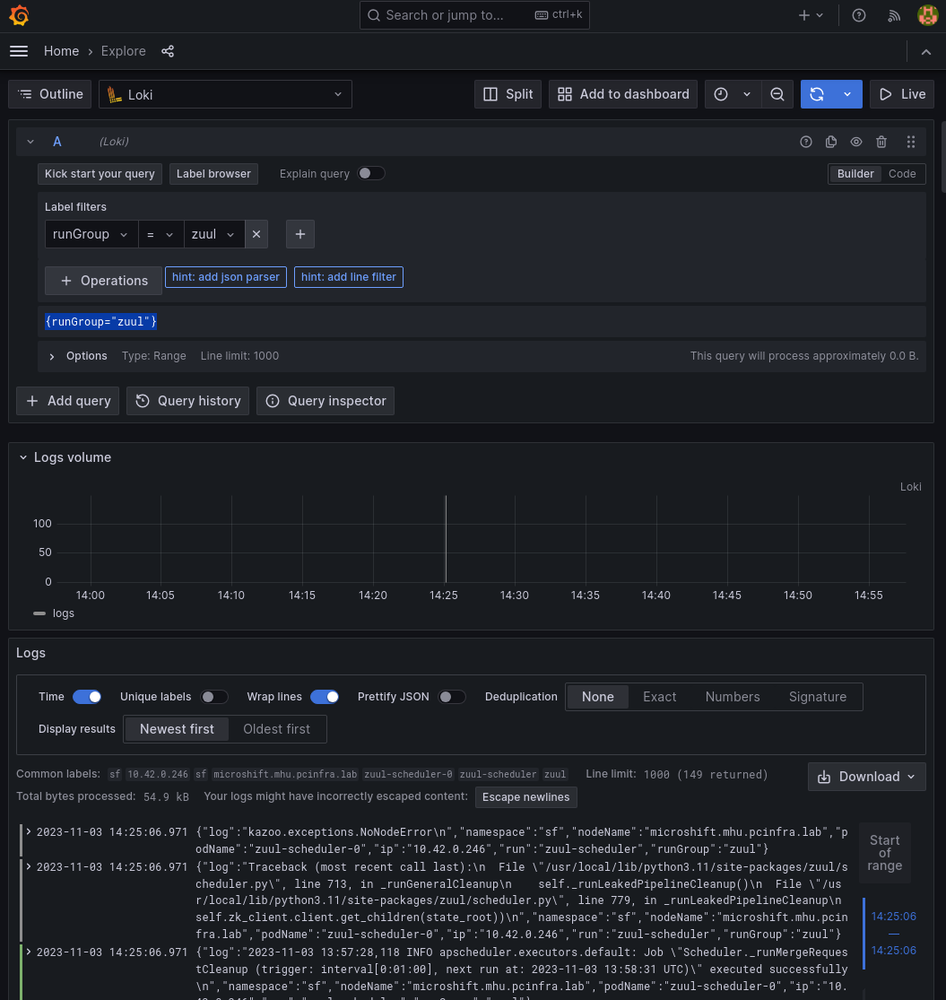

# Logging

This document describes different ways of handling log collection and aggregation for the services deployed with the SF-Operator.


1. [Using kubectl](#using-kubectl)
1. [Native Cluster Logging](#native-cluster-logging)
1. [Log Forwarding to a Fluent Bit collector](#log-forwarding-to-a-fluent-bit-collector)
1. [Example: Setting up a simple Fluent Bit + Loki stack for log collection](#example-setting-up-a-simple-fluent-bit-loki-stack-for-log-collection)

## Using kubectl

You can always check logs from **currently running** pods and containers by using the `kubectl logs` command, for example:

```sh
kubectl logs --tail=10 zuul-web-65b84c9f87-sp4fm
```

The major downside of this approach is that logs from terminated containers cannot be queried with `kubectl`.
If you need to check logs from init containers, crashed containers, batch jobs, or even
just containers that were destroyed after a configuration change, you will need to rely on
another tool.

## Native Cluster Logging

Some clusters may have a built-in log collection infrastructure in place. For example:

* On Amazon EKS,[you can forward logs to a collector of your choice with the built-in Fluent Bit collector](https://aws.amazon.com/blogs/containers/fluent-bit-for-amazon-eks-on-aws-fargate-is-here/).
* On OpenShift, [cluster logging and log aggregation in Loki can be optionally enabled](https://docs.openshift.com/container-platform/4.13/logging/cluster-logging.html).

Please refer to your cluster's documentation to find out what existing logging solutions are available to you.

## Log Forwarding to a Fluent Bit collector

Native cluster logging solutions **should always** be your first choice for managing the logs of
Zuul and Nodepool. This is almost always the best solution in terms of cluster resource usage and the most straightforward to implement as an application deployer.

If **however** no such solution is available, or if the default solution does not suit your
needs, the SF-Operator can set up Zuul and Nodepool to forward application logs to a
[Fluent Bit](https://fluentbit.io/) collector. The collector must be configured to expose a
[forward input](https://docs.fluentbit.io/manual/pipeline/inputs/forward) that your deployment
will be able to reach.

### Enabling log forwarding on a deployment

In the spec of your Software Factory deployment, edit the following:

```yaml
[...]
spec:
  FluentBitLogForwarding:
    forwardInputHost: "fluentbit-forward-input-service"
```

The **forwardInputHost** is the host of the HTTP input to which logs should be sent.

### Pre-defined labels

The log JSON payload that is sent to your Fluent Bit collector is enriched with the following keys:

| key | description or value |
|--------|------------------|
| labels_run    | the "run" label in the pod's metadata; i.e., the name of the microservice emitting the log line |
| labels_app    | the "app" label, which is always set to "sf" |
| podip     | [DEPRECATED] the IP address of the pod |
| namespace | the namespace where the pod is running |
| nodename | [DEPRECATED] the node where the pod is running |
| podname | [DEPRECATED] the name of the pod where the service is running |
| log    | the actual log line collected |
| component | the name of the component running the microservice, typically "zuul" or "nodepool" |
| container | the name of the container emitting the logs |

You can use these keys to define labels in your Fluent Bit pipeline.

## Example: Setting up a simple Fluent Bit + Loki stack for log collection

The `hack/loki` folder in the sf-operator repository has everything needed to deploy a minimal
Loki instance and configure log forwarding to this instance:

* [Loki manifest](https://raw.githubusercontent.com/softwarefactory-project/sf-operator/master/hack/loki/test-loki.yaml)
* [Fluent Bit manifest](https://raw.githubusercontent.com/softwarefactory-project/sf-operator/master/hack/loki/test-fluentbit.yaml)
* (Optional) [Grafana deployment with preconfigured monitoring and logging data sources](https://raw.githubusercontent.com/softwarefactory-project/sf-operator/master/hack/loki/test-grafana.yaml)

!!! danger
    These manifests are intended for testing purposes only and should not be used in production.

1. Download the files listed above.

2. Create a Loki instance in your SF deployment's namespace (assumed to be `sf`):

```sh
kubectl apply -f test-loki.yaml -n sf
```

or

```sh
kubectl apply -f https://raw.githubusercontent.com/softwarefactory-project/sf-operator/master/hack/loki/test-loki.yaml -n sf
```

3. Create a Fluent Bit instance:

```sh
kubectl apply -f test-fluentbit.yaml -n sf
```

or

```sh
kubectl apply -f https://raw.githubusercontent.com/softwarefactory-project/sf-operator/master/hack/loki/test-fluentbit.yaml -n sf
```

Fluent Bit will be configured with an HTTP input and will forward logs to stdout (so you can see them in the logs of the Fluent Bit pod) and to the Loki instance you created above.

A service is also created so that the HTTP input endpoint is available on the `sf` namespace.

4. Enable log forwarding in your Software Factory deployment's spec. Run:

```sh
kubectl edit sf my-sf
```

Then add or edit the following section in the spec:

```yaml
[...]
spec:
  FluentBitLogForwarding:
    forwardInputHost: fluent-bit-forward-input
    forwardInputPort: 24224
```


5. (Optional) Spin up an instance of Grafana to query logs:

```sh
sed -e 's|sfop.me|YOUR_FQDN|g' test-grafana.yaml | kubectl apply -f - -n sf
```

With your web browser of choice, you can then head to `http://grafana.<YOUR_FQDN>` (the default
authentication is admin/admin) and query the services' logs.


